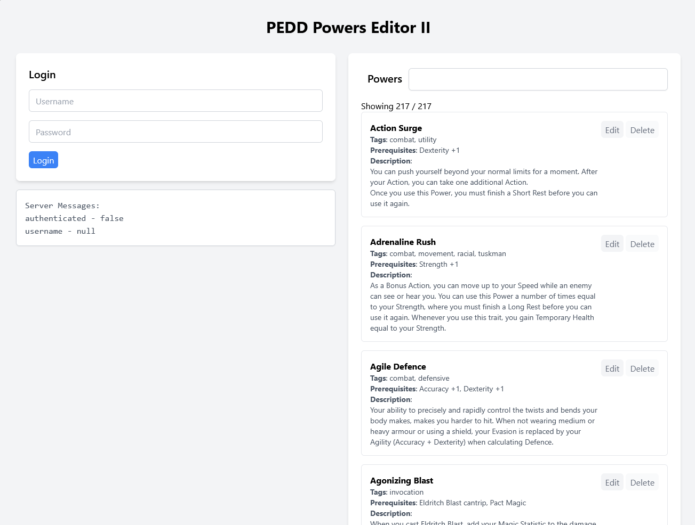
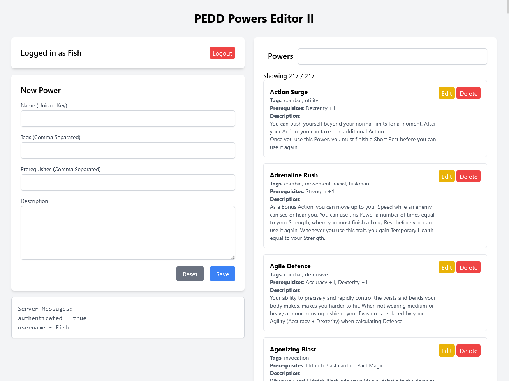
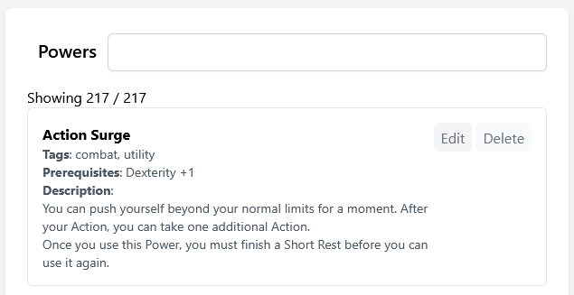

# PEDD_Powers_Editor
This was a one day project where I sat down to revise PHP as it's been over 2 years since I really did anything with it.

I did so by creating a PHP powered CRUD application for my ongoing project of building my own TTRPG, with this being an editor for the extensive powers system that it uses.

The program is very simple: there is an `index.html` page front end with some basic Tailwind CSS on it that sends requests to the `PEDD_Powers.php` back-end that processes and returns the necessary data.

This controller makes use of an encapsulated simple session based authenticator found in `SessionAuth.php`. The login details are (for now) hard-coded via the `settings.json`.

## How to Run

Install PHP onto the machine you will use. [Install php](https://letmegooglethat.com/?q=install+php)

Host these files on a server. I just used Visual Studio Code and the PHP Server plugin to make things dead simple for local development.

[PHP Server](https://marketplace.visualstudio.com/items?itemName=brapifra.phpserver)

Access index.html. If PHP is installed and working correctly, you will be able to Create Read Update and Delete PEDD Powers!

## Showcase
The main page presents like this, note that authentication is not needed to see Powers (i.e. READ):

Logging in as you expect:

The view logged in. Note that the UI has changed to display the input and logout sections instead of the login section.

### Create

### Update

### Delete

